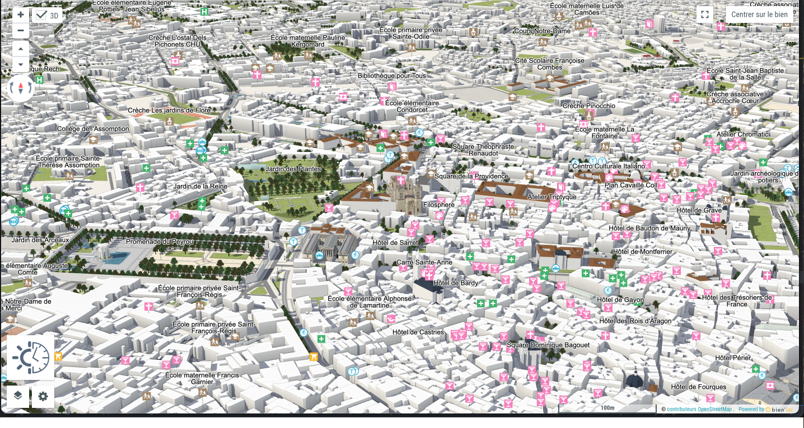

## Les prémisses

Le projet a pour but de créer une carte interactive permettant entre autre de visualiser les batiments avec des textures personnalisées ou des models 3D.

Pour commencer, nous allons nous inspirer de la carte de BienIci

url https://www.bienici.com/carte

- commencer par créer un projet Next.js
- y ajouter la librairie maplibre-gl
- y ajouter la possibilité de zoomer sur la carte
- y ajouter la possibilité de créer des polygones pour le remplissage
- y ajouter la possibilité d'activer, desactiver le mode 3D 
- y ajouter la possibiliter d'afficher le Soleil et les ombres des batiments et de l'environement
- puis ensuite ajouter des models 3D plutot que des textures

------------
This is a [Next.js](https://nextjs.org) project